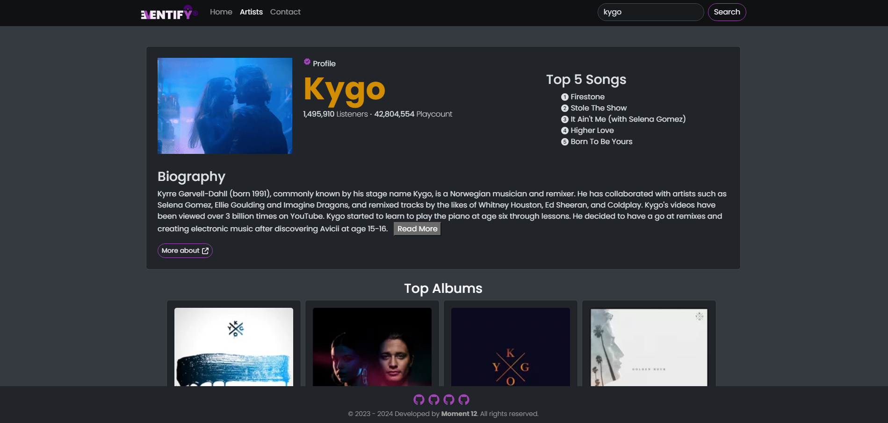
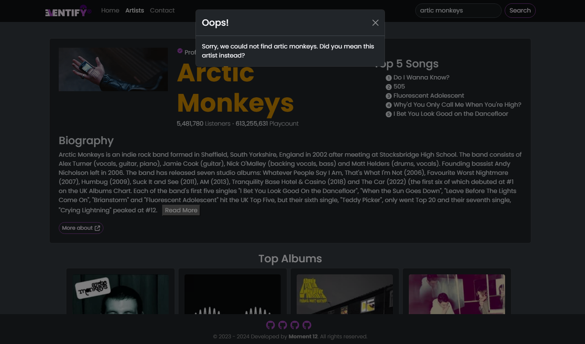
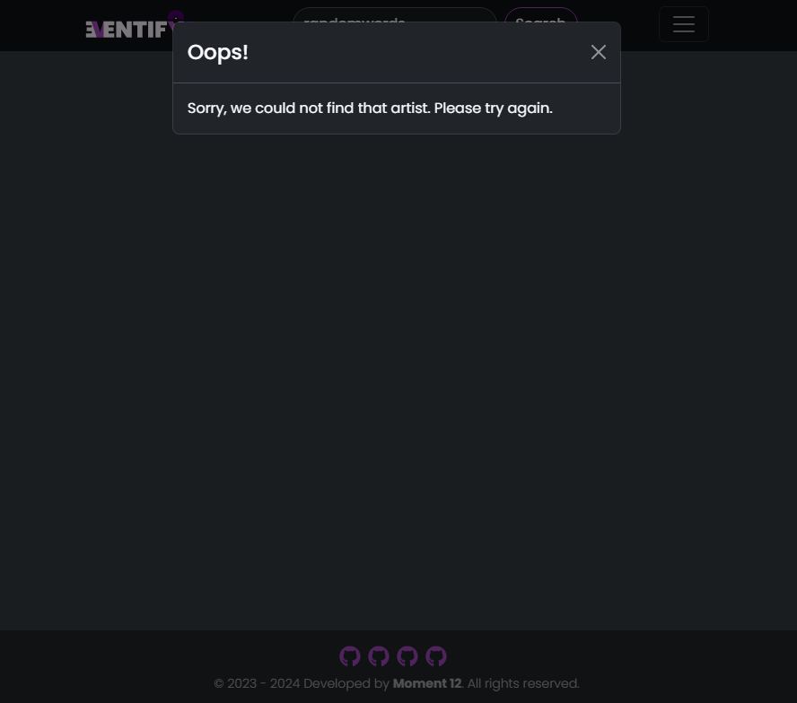

# Eventify

## Description
Eventify is a music dashboard application that provides users with comprehensive information about their favourite music artists or bands. Utilizing the LastFM API, Ticketmaster API and Giphy API, users can search for artists, view biographies, listeners and playcount data, top albums, upcoming events and find tickets. Additionally, users are presented with a list of alternative suggested artists based on their selection.

## Table of Contents
- [User Story](#user-story)
- [Installation](#installation)
- [Usage](#usage)
- [Technologies Used](#technologies-used)
- [Screenshots](#screenshots)
- [Credits](#credits)
- [Deployment](#deployment)
- [License](#license)
- [Badges](#badges)

## User Story
AS A music lover,   
I WANT to be able to search for my favourite artists and check their upcoming events,  
SO THAT I can learn more about the artists and book tickets for their shows.

## Installation
Users can install the project by cloning the repository from GitHub and running `npm install` to install the required dependencies.

## Usage
1. Search for an Artist: Start by entering the name of a music artist in the search input located at the top of the page.

2. Explore Artist Information:
    - Once a valid artist is entered and selected, the Artist page will be populated with comprehensive information about the selected artist.
    - Access the artist's profile, which includes the number of listeners and playcounts, top 5 songs, and read the artist's biography. Click the "Read More" button to extend the biography.
    - Additionally, find a button to direct the user to a third-party page with more information about the artist.

3. Discover Music:
Explore the artist's most popular albums and related genres.

4. Upcoming Events:
    - Check out the next four upcoming events for the artist, including detailed information about the event.
    - Find a link to purchase tickets for these events by clicking the "Find Tickets" button, which will redirect you to third-party e-commerce pages for ticket booking.

5. Similar Artists:
Discover similar artists based on the selected artist.

6. Additional Information:
    - On the home page, find general information about Eventify.
    - On the contact page, there is a form to get in touch.

## Technologies Used
- React
- Vite
- Node
- React-Router-Dom
- Popper
- Axios
- Dayjs
- React-Bootstrap: Carousel, Modal, Card, Button, etc.
- React-Icons
- Google Fonts

## Screenshots  

  
*The above image illustrates a screenshot of a searched-for artist.* 

Screenshot of the typo modal

Screenshot of the search error

Screenshot of the contact form

## Credits
- Team Moment 12
- Pratikto - Best tutor ever! 
- Badges documentation by Shields.io

## Deployment

This project is deployed and accessible at the following URLs:

- [Live Application](https://go-eventify.netlify.app/): Visit this link to explore the Eventify App.
- [GitHub Repository](https://github.com/deponte-designer/Eventify): Visit this repository for project details, including comprehensive README.

## Starred Project
⭐ Your support by clicking on the star icon located at the top right of the project page and adding it to your favourites list would be greatly appreciated!

## License

Copyright (c) 2024 Developed by Moment 12 - contributors [Skilton, J.](https://github.com/jsskilton) | [Ponte, N.](https://github.com/deponte-designer) | [Rainforth, S.](https://github.com/Meisterstu) | [Sodeke, A.](https://github.com/abbysod)
 
Permission is hereby granted, free of charge, to any person obtaining a copy of this software and associated documentation files (the "Software"), to deal in the Software without restriction, including without limitation the rights to use, copy, modify, merge, publish, distribute, sublicense, and/or sell copies of the Software, and to permit persons to whom the Software is furnished to do so, subject to the following conditions:

The above copyright notice and this permission notice shall be included in all copies or substantial portions of the Software.

THE SOFTWARE IS PROVIDED "AS IS", WITHOUT WARRANTY OF ANY KIND, EXPRESS OR IMPLIED, INCLUDING BUT NOT LIMITED TO THE WARRANTIES OF MERCHANTABILITY, FITNESS FOR A PARTICULAR PURPOSE AND NONINFRINGEMENT. IN NO EVENT SHALL THE AUTHORS OR COPYRIGHT HOLDERS BE LIABLE FOR ANY CLAIM, DAMAGES OR OTHER LIABILITY, WHETHER IN AN ACTION OF CONTRACT, TORT OR OTHERWISE, ARISING FROM, OUT OF OR IN CONNECTION WITH THE SOFTWARE OR THE USE OR OTHER DEALINGS IN THE SOFTWARE.

## Badges

